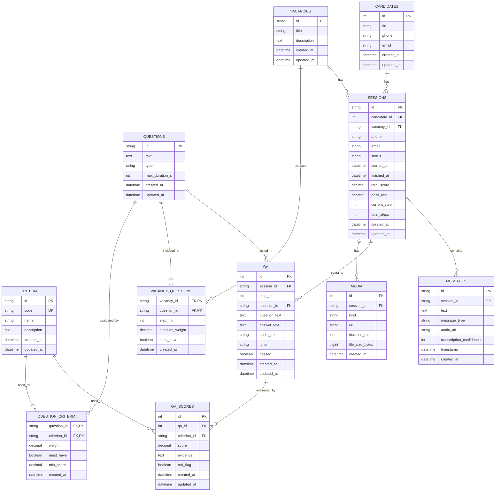

# ER Diagram - Interview AI Database

## Entity Relationship Diagram

## Table Descriptions

### Core Entities

- **CANDIDATES**: People who participate in interviews
- **VACANCIES**: Job positions being interviewed for
- **QUESTIONS**: Interview questions with metadata
- **CRITERIA**: Evaluation criteria for scoring answers

### Interview Process

- **SESSIONS**: Individual interview sessions linking candidates to vacancies
- **MESSAGES**: Chat messages within a session (both user and avatar messages)
- **QA**: Question-Answer pairs within a session
- **QA_SCORES**: Detailed scoring of answers against criteria
- **MEDIA**: Audio files for questions and answers

### Configuration

- **VACANCY_QUESTIONS**: Links questions to vacancies with ordering and weights
- **QUESTION_CRITERIA**: Links criteria to questions with weights and requirements

## Key Features

1. **Flexible Question-Criteria Mapping**: Each question can be evaluated against multiple criteria with different weights
2. **Must-Have Requirements**: Questions and criteria can be marked as required for passing
3. **Audio Support**: Full audio file management for questions and answers
4. **Session Tracking**: Complete interview session lifecycle management
5. **Detailed Scoring**: Granular scoring with evidence and red flags
6. **Chat Messages**: Support for storing conversation messages with audio URLs and transcription confidence
7. **Session Metadata**: Direct phone and email storage in sessions for quick access
