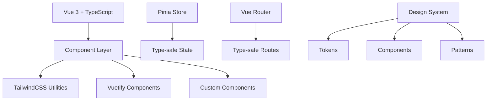

# Design Document

## Overview

Дизайн современной системы ИИ-интервью основан на принципах минимализма, функциональности и доступности. Система будет использовать гибридный подход с TailwindCSS для кастомных стилей и Vuetify для сложных компонентов, обеспечивая баланс между гибкостью и скоростью разработки.

### Design Philosophy

- **Минимализм**: Чистый интерфейс без лишних элементов
- **Функциональность**: Каждый элемент служит конкретной цели
- **Консистентность**: Единообразие во всех компонентах
- **Доступность**: Соответствие WCAG 2.1 AA стандартам
- **Адаптивность**: Mobile-first подход

## Architecture

### Technology Stack



### Project Structure

```
src/
├── components/           # Переиспользуемые компоненты
│   ├── base/            # Базовые UI компоненты
│   ├── forms/           # Компоненты форм
│   ├── layout/          # Компоненты макета
│   └── business/        # Бизнес-логика компоненты
├── composables/         # Vue 3 Composition API
├── types/              # TypeScript типы и интерфейсы
├── styles/             # Глобальные стили и темы
├── assets/             # Статические ресурсы
└── utils/              # Утилиты и хелперы
```

## Components and Interfaces

### Design System Tokens

#### Color Palette

```typescript
interface ColorPalette {
  // Primary Colors
  primary: {
    50: '#f0f9ff',
    100: '#e0f2fe',
    500: '#0ea5e9',  // Main brand color
    600: '#0284c7',
    900: '#0c4a6e'
  },
  
  // Neutral Colors
  neutral: {
    50: '#f8fafc',
    100: '#f1f5f9',
    200: '#e2e8f0',
    500: '#64748b',
    700: '#334155',
    900: '#0f172a'
  },
  
  // Semantic Colors
  success: '#10b981',
  warning: '#f59e0b',
  error: '#ef4444',
  info: '#3b82f6'
}
```

#### Typography Scale

```typescript
interface TypographyScale {
  fontFamily: {
    sans: ['Inter', 'system-ui', 'sans-serif'],
    mono: ['JetBrains Mono', 'monospace']
  },
  fontSize: {
    xs: '0.75rem',    // 12px
    sm: '0.875rem',   // 14px
    base: '1rem',     // 16px
    lg: '1.125rem',   // 18px
    xl: '1.25rem',    // 20px
    '2xl': '1.5rem',  // 24px
    '3xl': '1.875rem', // 30px
    '4xl': '2.25rem'  // 36px
  },
  fontWeight: {
    normal: 400,
    medium: 500,
    semibold: 600,
    bold: 700
  }
}
```

#### Spacing System

```typescript
interface SpacingSystem {
  spacing: {
    0: '0',
    1: '0.25rem',  // 4px
    2: '0.5rem',   // 8px
    3: '0.75rem',  // 12px
    4: '1rem',     // 16px
    6: '1.5rem',   // 24px
    8: '2rem',     // 32px
    12: '3rem',    // 48px
    16: '4rem',    // 64px
    20: '5rem'     // 80px
  }
}
```

### Core Components

#### 1. Layout Components

##### AppHeader Component
```typescript
interface AppHeaderProps {
  title?: string;
  showNavigation?: boolean;
  user?: UserInfo;
}

interface UserInfo {
  name: string;
  avatar?: string;
  role: 'hr' | 'admin' | 'candidate';
}
```

**Features:**
- Responsive navigation with mobile hamburger menu
- User profile dropdown
- Breadcrumb navigation
- Search functionality (where applicable)

##### AppSidebar Component
```typescript
interface AppSidebarProps {
  collapsed?: boolean;
  items: NavigationItem[];
}

interface NavigationItem {
  id: string;
  label: string;
  icon: string;
  route: string;
  children?: NavigationItem[];
  badge?: string | number;
}
```

##### AppFooter Component
```typescript
interface AppFooterProps {
  showLinks?: boolean;
  companyInfo?: CompanyInfo;
}
```

#### 2. Base UI Components

##### BaseButton Component
```typescript
interface BaseButtonProps {
  variant: 'primary' | 'secondary' | 'outline' | 'ghost' | 'danger';
  size: 'sm' | 'md' | 'lg';
  loading?: boolean;
  disabled?: boolean;
  icon?: string;
  iconPosition?: 'left' | 'right';
}
```

**Variants:**
- Primary: Основные действия (сохранить, создать)
- Secondary: Вторичные действия (отмена, назад)
- Outline: Альтернативные действия
- Ghost: Минимальные действия
- Danger: Деструктивные действия (удалить)

##### BaseCard Component
```typescript
interface BaseCardProps {
  title?: string;
  subtitle?: string;
  actions?: CardAction[];
  loading?: boolean;
  hoverable?: boolean;
  padding?: 'none' | 'sm' | 'md' | 'lg';
}

interface CardAction {
  label: string;
  icon?: string;
  action: () => void;
  variant?: ButtonVariant;
}
```

##### BaseInput Component
```typescript
interface BaseInputProps {
  type: 'text' | 'email' | 'password' | 'number' | 'tel';
  label: string;
  placeholder?: string;
  error?: string;
  hint?: string;
  required?: boolean;
  disabled?: boolean;
  icon?: string;
  iconPosition?: 'left' | 'right';
}
```

#### 3. Business Components

##### SessionCard Component
```typescript
interface SessionCardProps {
  session: InterviewSession;
  actions?: SessionAction[];
  showProgress?: boolean;
}

interface InterviewSession {
  id: string;
  vacancyTitle: string;
  candidatePhone: string;
  status: SessionStatus;
  progress: SessionProgress;
  score?: number;
  createdAt: Date;
  updatedAt: Date;
}
```

##### VacancyCard Component
```typescript
interface VacancyCardProps {
  vacancy: Vacancy;
  showActions?: boolean;
  compact?: boolean;
}

interface Vacancy {
  id: string;
  title: string;
  description: string;
  requirements: string[];
  department: string;
  location: string;
  salary?: SalaryRange;
  status: VacancyStatus;
}
```

### Responsive Design Strategy

#### Breakpoints
```typescript
const breakpoints = {
  sm: '640px',   // Mobile landscape
  md: '768px',   // Tablet
  lg: '1024px',  // Desktop
  xl: '1280px',  // Large desktop
  '2xl': '1536px' // Extra large
}
```

#### Layout Patterns

1. **Mobile (< 768px)**
   - Single column layout
   - Collapsible navigation
   - Stack cards vertically
   - Touch-friendly buttons (min 44px)

2. **Tablet (768px - 1024px)**
   - Two-column layout where appropriate
   - Sidebar can be toggled
   - Grid layouts for cards

3. **Desktop (> 1024px)**
   - Full sidebar navigation
   - Multi-column layouts
   - Hover states and tooltips
   - Keyboard shortcuts

## Data Models

### Core Types

```typescript
// User Management
interface User {
  id: string;
  email: string;
  name: string;
  role: UserRole;
  avatar?: string;
  preferences: UserPreferences;
}

type UserRole = 'admin' | 'hr' | 'interviewer' | 'candidate';

interface UserPreferences {
  theme: 'light' | 'dark' | 'system';
  language: string;
  notifications: NotificationSettings;
}

// Interview System
interface InterviewSession {
  id: string;
  vacancyId: string;
  candidateInfo: CandidateInfo;
  status: SessionStatus;
  currentStep: number;
  totalSteps: number;
  responses: InterviewResponse[];
  scores: SessionScores;
  metadata: SessionMetadata;
  createdAt: Date;
  updatedAt: Date;
}

type SessionStatus = 'created' | 'in_progress' | 'completed' | 'failed' | 'cancelled';

interface CandidateInfo {
  phone: string;
  email?: string;
  name?: string;
  resumeId?: string;
}

interface InterviewResponse {
  questionId: string;
  question: string;
  answer: string;
  audioUrl?: string;
  score?: number;
  feedback?: string;
  timestamp: Date;
}

// Vacancy Management
interface Vacancy {
  id: string;
  title: string;
  description: string;
  requirements: string[];
  responsibilities: string[];
  department: string;
  location: string;
  employmentType: EmploymentType;
  experienceLevel: ExperienceLevel;
  salary?: SalaryRange;
  benefits?: string[];
  status: VacancyStatus;
  scenarioId?: string;
  createdBy: string;
  createdAt: Date;
  updatedAt: Date;
}

type EmploymentType = 'full_time' | 'part_time' | 'contract' | 'internship';
type ExperienceLevel = 'entry' | 'junior' | 'middle' | 'senior' | 'lead';
type VacancyStatus = 'draft' | 'active' | 'paused' | 'closed';

interface SalaryRange {
  min: number;
  max: number;
  currency: string;
  period: 'hour' | 'month' | 'year';
}
```

## Error Handling

### Error Display Strategy

1. **Form Validation Errors**
   - Inline field errors
   - Summary at form top for multiple errors
   - Real-time validation feedback

2. **API Errors**
   - Toast notifications for temporary errors
   - Modal dialogs for critical errors
   - Retry mechanisms where appropriate

3. **Network Errors**
   - Offline indicators
   - Automatic retry with exponential backoff
   - Cached data fallbacks

### Error Types

```typescript
interface AppError {
  code: string;
  message: string;
  details?: Record<string, any>;
  timestamp: Date;
  context?: ErrorContext;
}

interface ErrorContext {
  component: string;
  action: string;
  userId?: string;
  sessionId?: string;
}

type ErrorSeverity = 'low' | 'medium' | 'high' | 'critical';
```

## Testing Strategy

### Component Testing
- Unit tests for all base components
- Integration tests for business components
- Visual regression tests for UI consistency
- Accessibility tests (axe-core)

### E2E Testing
- Critical user journeys
- Cross-browser compatibility
- Mobile device testing
- Performance testing

### Testing Tools
```typescript
// Test utilities
interface TestUtils {
  renderComponent: (component: Component, props?: any) => RenderResult;
  mockApi: (endpoints: ApiEndpoint[]) => void;
  simulateUser: (actions: UserAction[]) => Promise<void>;
  checkAccessibility: (element: HTMLElement) => Promise<AxeResults>;
}
```

## Performance Considerations

### Optimization Strategies

1. **Code Splitting**
   - Route-based splitting
   - Component lazy loading
   - Dynamic imports for heavy libraries

2. **Asset Optimization**
   - Image optimization and WebP support
   - Icon sprite sheets
   - Font subsetting

3. **Runtime Performance**
   - Virtual scrolling for large lists
   - Debounced search inputs
   - Memoized computed properties
   - Efficient state management

### Performance Metrics

- First Contentful Paint (FCP) < 1.5s
- Largest Contentful Paint (LCP) < 2.5s
- Cumulative Layout Shift (CLS) < 0.1
- First Input Delay (FID) < 100ms

## Accessibility Guidelines

### WCAG 2.1 AA Compliance

1. **Color and Contrast**
   - Minimum contrast ratio 4.5:1 for normal text
   - Minimum contrast ratio 3:1 for large text
   - Color not the only means of conveying information

2. **Keyboard Navigation**
   - All interactive elements accessible via keyboard
   - Logical tab order
   - Visible focus indicators
   - Skip links for main content

3. **Screen Reader Support**
   - Semantic HTML structure
   - Proper ARIA labels and roles
   - Alternative text for images
   - Form labels and descriptions

4. **Responsive Design**
   - Content reflows at 320px width
   - No horizontal scrolling at 400% zoom
   - Touch targets minimum 44x44px

### Implementation Guidelines

```typescript
// Accessibility utilities
interface A11yUtils {
  announceToScreenReader: (message: string) => void;
  trapFocus: (element: HTMLElement) => () => void;
  generateId: (prefix: string) => string;
  checkColorContrast: (foreground: string, background: string) => number;
}
```